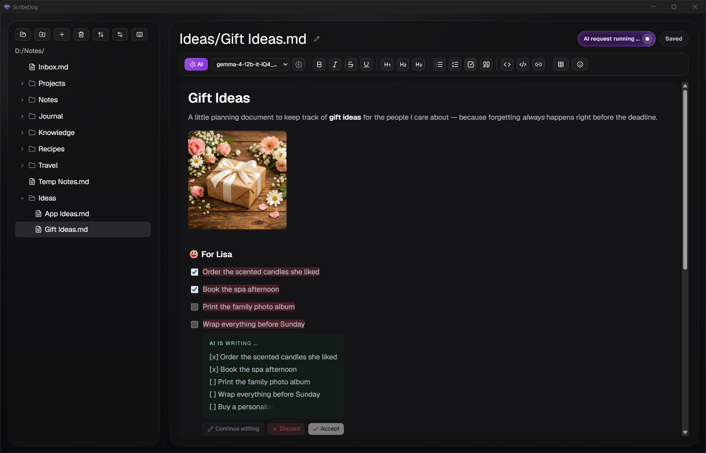
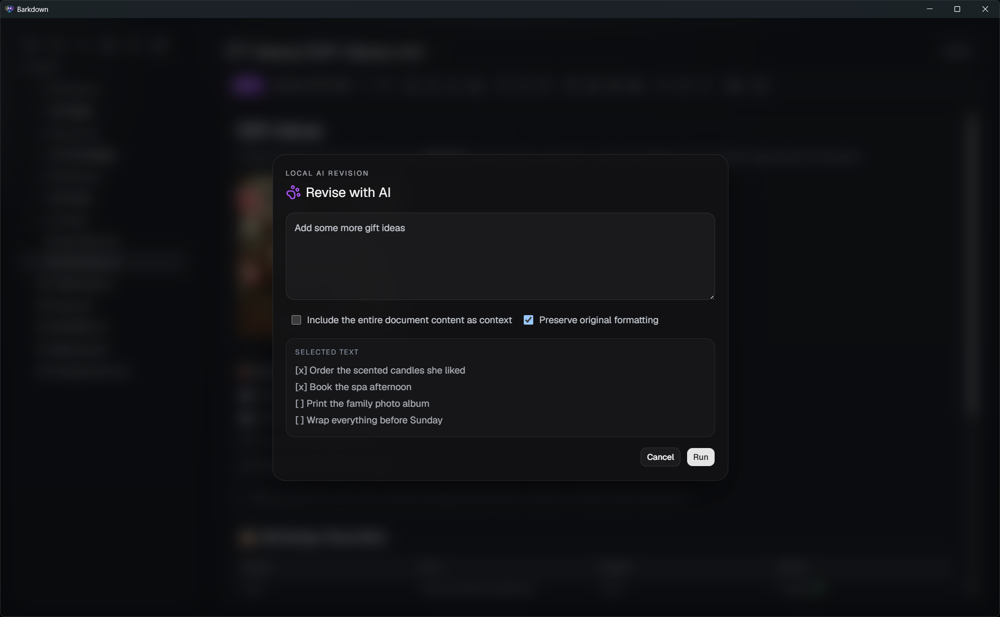
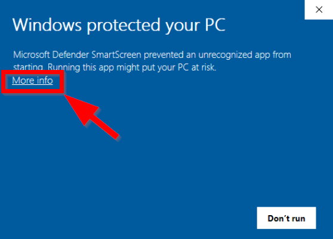
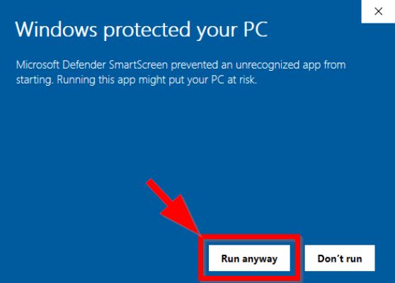

<div align="center">


# ScribeDog

**Your private writing studio — an AI-powered WYSIWYG Markdown editor.**\
**Open source, no cloud required — your words stay on your machine.**

[](https://github.com/snooky234/scribedog/releases/latest)
[](https://github.com/snooky234/scribedog/releases)
[](LICENSE)


</div>

ScribeDog is a native desktop editor where you write and format text as a
polished document — no raw `#` or `*` characters in sight — and can select any
passage and hand it to an AI model to rewrite, extend, translate, or generate
text. You choose where that model runs: **fully local** on your own machine —
so no byte ever leaves your device — or with a **cloud provider you trust**,
using your own API key.

Whatever you write — **personal notes, journals, letters, blog posts,
documentation, essays, or fiction** — ScribeDog gives you a clean, distraction-free
place to write it, with an AI assistant that respects one simple rule:
**your words are yours.** No account, no subscription, no server in between.




**Why ScribeDog?**

- ✨ **True WYSIWYG** — headings, tables, images, and lists look like a document, not like syntax
- 🤖 **AI built in, local by default** — rewrite or generate text with Ollama, Jan.ai, or LM Studio; cloud providers are strictly opt-in
- 📥 **Import & export built in** — bring Word, PDF, and HTML files in as Markdown (even images, via AI-powered OCR) and export notes or whole folders to PDF, DOCX, ODT, or HTML
- 🔓 **100% open source** — MIT-licensed, every release built transparently from this repository by GitHub Actions
- 🔒 **No telemetry** — no analytics, no account; the only automatic network call is an optional, disableable update check
- ⚡ **Lightweight** — built with Tauri, starts instantly, files stay plain `.md`

**Local AI is genuinely usable today.** You don't need a data center: modern
open models like **Gemma 3/4** or **Qwen 3** already deliver good results on a
mid-range gaming GPU with 6 GB VRAM (e.g. an RTX 4050) — and smaller variants
run even on laptops without a dedicated GPU. That's more than enough to
rewrite paragraphs, fix tone and grammar, draft a letter, or summarize your
notes — fluently, privately, and for free.

**Who is ScribeDog for?**

- 📝 **Note-takers & journalers** — keep a private knowledge folder or diary that no cloud service sees
- ✉️ **Everyday writers** — letters, applications, emails, meeting notes; let the AI polish tone and wording locally
- ✍️ **Authors & bloggers** — draft, rewrite, and expand creative text with an AI that doesn't train on your manuscript
- 🧑‍💻 **Developers & documenters** — clean, diff-friendly Markdown files that work with Git and every other tool

---

## 📥 Installation

Grab the latest installer for your platform from the
[**Releases page**](https://github.com/snooky234/scribedog/releases/latest):

**Windows**
- `ScribeDog_x.y.z_x64-setup.exe` — NSIS installer (recommended). Also adds an optional **"Open with ScribeDog"** entry to the Explorer folder context menu.
- `ScribeDog_x.y.z_x64_en-US.msi` — MSI package

**Linux**
- `ScribeDog_x.y.z_amd64.AppImage` — no installation needed, just mark it executable and run it
- `ScribeDog_x.y.z_amd64.deb` — for Debian/Ubuntu-based distributions

> **Note:** The installers are not code-signed, so you may see a warning on
> first launch — Windows SmartScreen ("More info → Run anyway"). You can
> verify every release is built directly from this repository by GitHub
> Actions.

### ⚠️ About the "Windows protected your PC" warning

Because ScribeDog's installers aren't (yet) signed with a paid code-signing
certificate, Windows SmartScreen shows this warning the first time you run a
freshly downloaded installer. **This is expected and not a sign that
anything is wrong** — it simply means the binary hasn't built up enough
reputation with Microsoft yet, not that it's been flagged as malicious.
Every release is built transparently from this repository's source by
GitHub Actions, so you can always verify what went into it.

To proceed:

1. Click **"More info"**.

   

2. Click **"Run anyway"**.

   

**Heads-up:** some antivirus/security suites also run their own scan on the
installer during setup (in addition to, or instead of, SmartScreen). This is
normal for unsigned, less widely distributed apps — just let the scan
finish. If you want to double-check what's actually in a given release,
compare it against the corresponding [GitHub Actions build](https://github.com/snooky234/scribedog/actions)
and the source in this repository.

---

## Features

### 🤖 AI-assisted writing — local by default, cloud if you want it
- Select any text, press `Ctrl+E` (or right-click), type a prompt, and watch the model rewrite or insert content **live** into your document
- Works out of the box with **Ollama**, **Jan.ai**, and **LM Studio** (local) as well as **OpenAI**, **Anthropic**, and **Mistral** (cloud, bring your own key)
- Optional toggles to include the whole document as context and to preserve formatting
- Model "thinking"/reasoning output is filtered automatically — only the final answer touches your document
- **Review before you accept** — the original passage stays untouched (highlighted in red) while the AI's answer streams in right below it as a live Markdown preview; **accept**, **discard**, or **keep refining** with another prompt before anything actually changes your document
- Every AI edit is a single atomic change: one `Ctrl+Z` fully undoes it
- **AI spelling & grammar check** — select a passage, press `Ctrl+Shift+X` (or use the toolbar button), and get a clear list of issues with suggested corrections and explanations; apply them one by one or all at once

### ✍️ True WYSIWYG Markdown editing
- Powered by [TipTap](https://tiptap.dev/)/ProseMirror — headings, bold, italic, underline, strikethrough, blockquotes, inline code, links, and ordered/bulleted/task lists all render as formatted content instead of raw syntax
- **Tables** with a visual grid picker and a context menu for adding/removing rows and columns
- **Images** render inline; resize them by dragging, and the width is persisted back into the Markdown
- **Code blocks** with a one-click copy button
- **Emoji picker** with search, including keywords in your local language
- **Spell check as you type** — optional red-underline spell checking powered by your operating system's built-in spellchecker (toggle it in the toolbar options; on Linux it uses your installed Hunspell/enchant dictionaries)
- Files are saved as clean, diff-friendly Markdown — fully portable to any other tool

### 📥 Import your existing documents
- **One-click import from the sidebar** — pick one or more files and each becomes a clean Markdown file in your vault
- **Word (`.docx`), PDF, and HTML** are converted **entirely offline** — structure like headings, lists, emphasis, and tables is preserved as far as the source allows, and no AI or network connection is needed
- **Embedded images** are extracted into the vault's `images/` folder and linked automatically, just like pasted images
- **Images become text** — import screenshots, scans, or photos of pages (PNG, JPG, GIF, WebP) and your configured **vision-capable AI model** turns them into editable Markdown via OCR — locally, if that's where your model runs
- Existing files are never overwritten — name conflicts get a numeric suffix, and a mixed batch imports what it can instead of failing as a whole

### 📤 Export for sharing and printing
- Right-click any file or folder in the sidebar and choose **Export…** — to **PDF, DOCX, ODT, or HTML**
- **Whole folders export recursively**, preserving your subfolder structure — turn a project folder into a set of shareable documents in one go
- Embedded images and emoji come along, rendered in a clean sans-serif document style
- Safe by design: existing files are never silently overwritten — you're asked per file, with an "apply to all" option, and the last export destination is remembered

### 📂 File management built in
- Open any folder and ScribeDog finds every `.md` file inside it, shown as a file tree in the sidebar
- Create, rename, and delete files and folders directly from the sidebar
- **Flexible sorting** — order the file tree by name, last modified, or switch to manual mode and drag and drop files and folders into your own order
- Sidebar preferences (sort mode, manual order) are remembered per folder in a small hidden `.scribedog` metadata directory inside the vault
- Live sync via a native filesystem watcher — changes made outside the app are picked up automatically
- Safe switching: leaving an unsaved file (or a pending, undecided AI suggestion) prompts you to save, discard, or cancel, with a clear dirty indicator

### 🎨 Comfortable to use
- Light and dark theme
- Interface available in **10 languages** — English, German, Spanish, French, Italian, Portuguese, Russian, Ukrainian, Japanese, and Chinese
- One-click formatting toolbar with active-state highlighting
- Built-in keyboard shortcuts cheat sheet (`Ctrl+#`)
- Window size and maximized state are remembered across restarts
- Launch ScribeDog on a folder from the command line or (on Windows) via the Explorer context menu

### 🔒 Privacy first
- No telemetry, no analytics — ScribeDog doesn't collect or transmit usage data. The one exception: on Windows, it checks GitHub on startup for a new release (a simple version comparison, no usage data sent), which can be turned off in settings
- Beyond that optional update check, local AI providers mean the only network call is to the local endpoint *you* configure, and only when you trigger an AI action
- Cloud AI is strictly **bring-your-own-key**: your key is stored in the operating system's credential store (Windows Credential Manager, macOS Keychain, Linux Secret Service) — not in plain text on disk — and sent only to the provider you chose, with no ScribeDog server in between. The settings dialog shows a clear notice whenever a cloud provider is selected
- Tauri capabilities are scoped tightly: filesystem access is limited to the folder you open, HTTP access to your configured AI endpoint

---

## Setting up AI rewriting

The AI feature is entirely optional and configured in the **AI settings**
dialog (provider, API URL, model, context length, thinking mode — all stored
locally on your device).

### Local (recommended — nothing leaves your device)

1. Install and run [Ollama](https://ollama.com/) (default `http://localhost:11434`), [Jan.ai](https://jan.ai/) (default `http://localhost:1337`), or [LM Studio](https://lmstudio.ai/) (default `http://localhost:1234`) and pull/load a model.
2. In ScribeDog, open **AI settings** and choose your provider and model.
3. Select some text, press `Ctrl+E`, enter a prompt, and let the model rewrite or insert content in place.

### Cloud (opt-in — bring your own API key)

1. In **AI settings**, choose **OpenAI**, **Anthropic**, or **Mistral**.
2. Paste an API key you created in that provider's dashboard. The key is stored only locally and sent only to that provider's API.
3. Note: with a cloud provider, the selected text (and the whole document, if you enable "include document as context") is transmitted to that provider under its own terms of service and privacy policy — read those before sending anything sensitive.

---

## 🗺️ Roadmap — where ScribeDog is heading

ScribeDog aims to become the **private writing studio** for everyone who writes —
without compromising on the local-first, open-source principles above.
Ideas on the list for upcoming versions (subject to change, feedback welcome!):

- 🧘 **Focus mode** — dim everything except the current sentence or paragraph, typewriter scrolling, distraction-free full screen
- ⚡ **One-click AI presets** — reusable actions like "tighten", "more vivid", "fix grammar", "translate", "formal tone" right in the context menu
- 📚 **Context notes ("story bible")** — keep character sheets, glossaries, or project notes in a folder and have them automatically included as AI context
- 🎯 **Writing goals & statistics** — word-count targets, reading time, daily progress
- ✒️ **Offline style & readability analysis** — highlight filler words, passive voice, and long sentences; optional local grammar checking (e.g. LanguageTool)
- 💡 **AI autocomplete** — optional inline "ghost text" suggestions while you type, accepted with `Tab`

Have a feature you'd love to see? [Open an issue](https://github.com/snooky234/scribedog/issues) — ScribeDog is shaped by its users.

---

## 🛠️ Building from source

Requires [Node.js](https://nodejs.org/) and the
[Rust/Tauri toolchain](https://tauri.app/start/prerequisites/) for your platform.

```bash
# Install dependencies
npm install

# Start the app in development mode
npm run tauri dev

# Type-check and build the frontend
npm run build

# Build the installer(s) for the current platform
# (Windows: NSIS + MSI · Linux: AppImage + .deb)
npm run tauri build
```

### Tech stack

| Layer | Technology |
|---|---|
| App shell | [Tauri 2](https://tauri.app/) |
| UI | React 18 + TypeScript + Vite |
| Editor engine | [TipTap](https://tiptap.dev/) (ProseMirror) + `tiptap-markdown` |
| Styling | Tailwind CSS + shadcn/ui + lucide-react icons |
| State / i18n | Zustand · i18next (10 languages) |
| AI providers | Ollama / Jan.ai / LM Studio (local), OpenAI / Anthropic / Mistral (cloud) via `@tauri-apps/plugin-http` |

## Contributing

Issues and pull requests are welcome! If you'd like to add an AI provider,
the adapter design in `src/lib` makes that straightforward.

## License

[MIT](LICENSE)
