<div align="center">

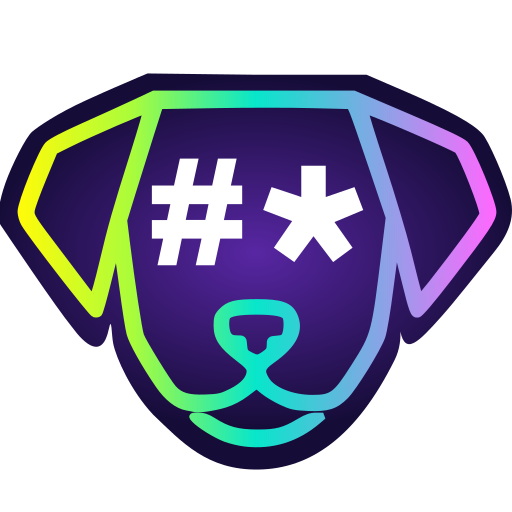

# ScribeDog

**Your private writing studio — an AI-powered WYSIWYG Markdown editor.**\
**Open source, no cloud required — your words stay on your machine.**

[](https://github.com/snooky234/scribedog/releases/latest)
[](https://github.com/snooky234/scribedog/releases)
[](LICENSE)


</div>

ScribeDog is a native desktop editor where you write and format text as a
polished document, no raw `#` or `*` characters in sight. You can select
any passage and hand it to an AI model to **rewrite, extend, translate, or
generate text**, or simply **dictate by voice**, entirely offline. You choose where
that AI model runs, **fully local** on your own machine so that no byte ever
leaves your device, or with a **cloud provider** you trust, using your own API
key.

Whatever you write — **personal notes, journals, letters, blog posts,
documentation, essays, or fiction** — ScribeDog gives you a clean, distraction-free
place to write it, with an AI assistant that respects one simple rule:
**your words are yours.** No account, no subscription, no server in between.

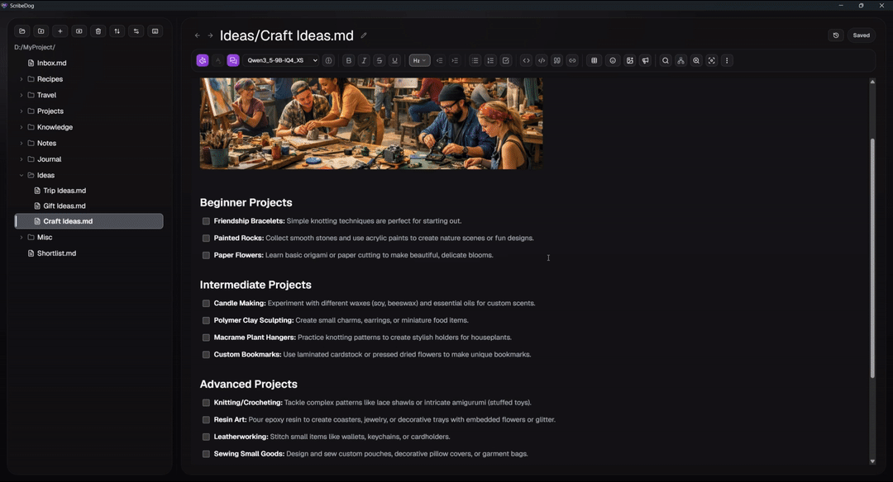

**Why ScribeDog?**

- ✨ **True WYSIWYG** — headings, tables, images, and lists look like a document, not like syntax
- 🔗 **Linked notes** — link one note to another by dragging it in from the sidebar, from the link dialog, or by typing `[[`; a click opens the target, and an optional panel shows links and backlinks
- 🤖 **AI built in, local by default** — rewrite or generate text with Ollama, Jan.ai, or LM Studio; cloud providers are strictly opt-in
- 💬 **Agentic AI chat** — a side-panel chat that reads your document and proposes edits itself, each one reviewed before it touches the file; needs a capable (9B+) model, smaller models should stick to simple select-and-rewrite
- 🗂️ **Vault-wide edits** — the chat can propose changes to *any* file in your vault, not just the open one, shown as the same red/green review when you open that file, and it can undo a whole batch of applied changes in one click
- 🧭 **Multi-step plans** — for goals that span several files, the agent keeps a visible step-by-step plan instead of trying everything in one leap
- 📚 **Knowledge base** — let the AI look things up across your own notes, not just the open file, and answer with the sources it used; searches by word or, opt-in, by meaning via an embedding model; folder by folder
- 📎 **Files as context** — drag notes from the sidebar, or files straight from outside the app (text, Word, PDF, even images via OCR), onto the chat and ask about them directly
- 🧩 **Custom assistants** — save your own system prompts ("translate to English", "make more formal", …) and switch between them right from the chat panel
- 🕓 **Automatic version history** — every save can be snapshotted locally; browse, diff, and restore any previous version with one click
- 🎙️ **Voice input, 100% offline** — dictate straight into your document or into the AI prompt; speech recognition runs locally via whisper.cpp, no cloud involved
- 📥 **Import & export built in** — bring Word, PDF, and HTML files in as Markdown (even images, via AI-powered OCR), by picking them or by dragging files or whole folders in from outside the app, and export notes or whole folders to PDF, DOCX, ODT, or HTML
- 🔓 **100% open source** — MIT-licensed, every release built transparently from this repository by GitHub Actions
- 🔒 **No telemetry** — no analytics, no account; the only automatic network call is an optional, disableable update check
- ⚡ **Lightweight** — built with Tauri, starts instantly, files stay plain `.md`

**Local AI is genuinely usable today.** You don't need a data center: modern
open models like **Gemma 3/4** or **Qwen 3** already deliver good results on a
mid-range gaming GPU with 6 GB VRAM (e.g. an RTX 4050) — and smaller variants
run even on laptops without a dedicated GPU. That's more than enough to
rewrite paragraphs, fix tone and grammar, draft a letter, or summarize your
notes — fluently, privately, and for free.

**Who is ScribeDog for?**

- 📝 **Note-takers & journalers** — keep a private knowledge folder or diary that no cloud service sees
- ✉️ **Everyday writers** — letters, applications, emails, meeting notes; let the AI polish tone and wording locally
- ✍️ **Authors & bloggers** — draft, rewrite, and expand creative text with an AI that doesn't train on your manuscript
- 🧑‍💻 **Developers & documenters** — clean, diff-friendly Markdown files that work with Git and every other tool

---

## Features

### 📋 Feature overview

| Feature | What it does | Shortcut / access |
|---|---|---|
| 🤖 AI rewrite & insert | Rewrite, extend, or generate text in place, local or cloud model | `Ctrl+E` / right-click |
| 💬 Agentic AI chat | Side-panel chat that reads your document and proposes edits via tool calls | `Ctrl+Shift+A` |
| 🗂️ Vault-wide edits | The chat proposes changes to any file in your vault, reviewed as red/green diffs, with one-click revert | Open the affected file |
| 🧭 Multi-step plans | Visible step-by-step plan for goals that touch several files | Chat panel, agent settings |
| 📚 Knowledge base | The AI searches your whole folder of notes — by word or by meaning — and answers from them, listing its sources | Settings → Knowledge base |
| 📎 Files as chat context | Drag notes or text files onto the chat panel and ask about their content | Drag & drop into chat |
| ✅ AI spelling & grammar check | List of issues with suggested corrections, apply one by one or all at once | `Ctrl+Shift+X` / toolbar |
| 🕓 Document versions | Automatic local snapshots on save; diff and restore any previous version | Version history popover |
| 🧘 Zen mode | Full-screen, distraction-free writing with a resizable text column | `Ctrl+Shift+Y` / toolbar |
| 🎙️ Voice input | Offline dictation into the document or straight into an AI prompt | `Ctrl+Shift+W` / `Ctrl+Shift+E` |
| 🧩 Custom assistants | Named, reusable system prompts for the AI chat, switchable in-panel | Chat panel dropdown |
| ✍️ WYSIWYG editing | Headings, tables, images, lists, code blocks, emoji, spell check | — |
| 🔗 Linked notes | Link notes by drag, dialog, or `[[`; links & backlinks in the details panel; back/forward history | `Ctrl+L` · `Ctrl+Shift+D` · `Alt+←`/`Alt+→` |
| 🔍 Details panel | Links and backlinks of the open note plus its word count, reading time and edit dates | `Ctrl+Shift+D` / toolbar |
| 📥 Import | Bring in Word, PDF, HTML, or images (via AI OCR) as clean Markdown | Sidebar import |
| 📤 Export | Export notes or whole folders to PDF, DOCX, ODT, or HTML | Right-click → Export… |
| 📂 File management | File tree, create/rename/delete, flexible sorting, live filesystem sync | Sidebar |
| 📱 Mobile access & sync | Plain `.md` files work with any sync service and mobile Markdown app | Bring your own sync |
| 🎨 Customizable UI | Light/dark theme, 10 languages, fully remappable keyboard shortcuts | `Ctrl+#` (shortcuts cheat sheet) |
| 🔒 Privacy first | No telemetry, bring-your-own-key cloud AI, tightly scoped filesystem access | — |

### 🤖 AI-assisted writing — local by default, cloud if you want it
- Select any text, press `Ctrl+E` (or right-click), type a prompt, and watch the model rewrite or insert content **live** into your document
- Works out of the box with **Ollama**, **Jan.ai**, and **LM Studio** (local) as well as **OpenAI**, **Anthropic**, and **Mistral** (cloud, bring your own key)
- Optional toggles to include the whole document as context and to preserve formatting
- Model "thinking"/reasoning output is filtered automatically — only the final answer touches your document

  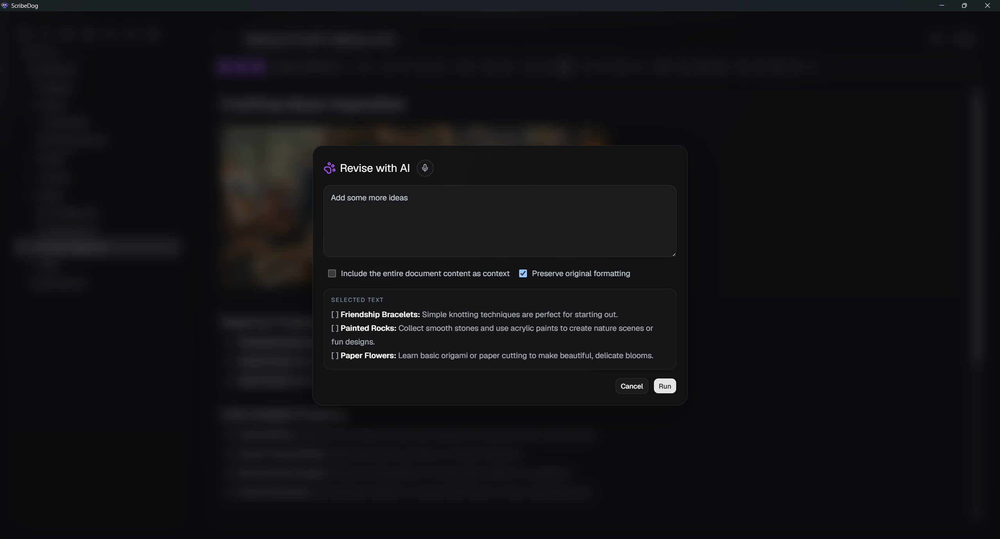

- **Review before you accept** — the original passage stays untouched (highlighted in red) while the AI's answer streams in right below it as a live Markdown preview; **accept**, **discard**, or **keep refining** with another prompt before anything actually changes your document

  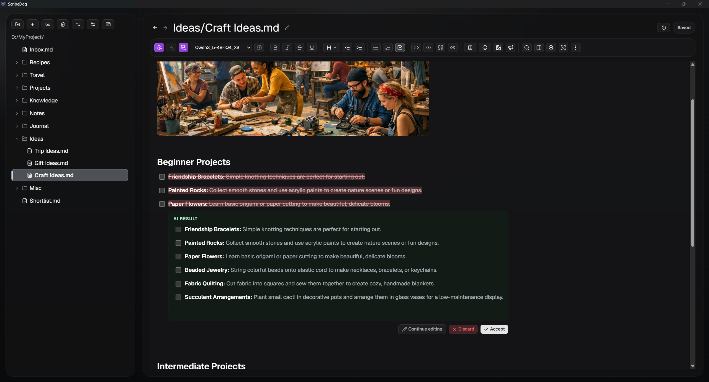

- Every AI edit is a single atomic change: one `Ctrl+Z` fully undoes it
- **AI spelling & grammar check** — select a passage, press `Ctrl+Shift+X` (or use the toolbar button), and get a clear list of issues with suggested corrections and explanations; apply them one by one or all at once

### 💬 AI chat — agentic editing
- Press `Ctrl+Shift+A` (or the toolbar button) to open the **chat panel** — a resizable side panel with its own session history, separate from the quick select-and-rewrite flow above
- This is more than a Q&A box: the chat is **agentic**. It can call tools on its own to read your document or current selection, insert text at the cursor, replace a specific passage, or resize an embedded image — deciding what a request actually needs instead of you spelling out every step
- **Nothing changes your document silently** — every proposed edit goes through the exact same red/green **review widget** as the rest of ScribeDog's AI features: accept, discard, or ask for another version before anything is written
- Attach an image from your document to the conversation and ask a vision-capable model about it
- Multiple sessions, rich Markdown rendering of the model's replies, a running indicator while it's thinking, and a request timeout so a stalled call never hangs the panel

  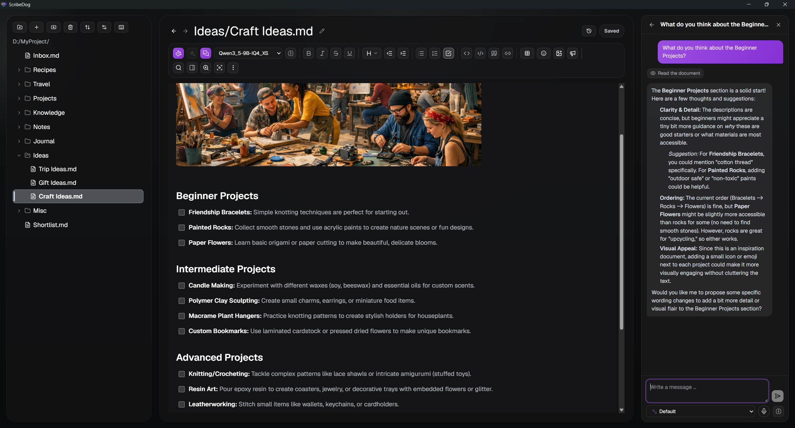

- **Edits reach the whole vault, not just the open file** — ask for a change to a note you haven't even opened and the agent proposes it anyway. Since a closed file has no editor for a proposal to live in, it's staged instead: open that file afterward and it shows the exact same red/green review as an open-document edit, with the file locked against further typing until you accept, discard, or ask for a revision — so the change is always reviewed against the content it was actually computed from
- **One-click undo for a whole batch** — applying staged changes writes a checkpoint first, so if a multi-file edit turns out wrong you can revert the entire batch in one step, not file by file
- **Multi-step plans for goals spanning several files** — for something bigger than a single edit, the agent keeps a visible, numbered plan in the chat instead of trying to do everything in one reply; turn it on in the agent settings, either as a separate planning step before it starts or with the model maintaining its own plan as it works
- **Model recommendation:** reliable tool-calling is genuinely hard for small models. Local models from roughly **9B parameters** upward (e.g. Qwen 3.5 9B, Gemma 4 12B) or any of the supported cloud models handle the chat's agentic tools well. **Below that**, a model tends to call tools incorrectly or not at all — for those, use the simple **select text → `Ctrl+E`** rewrite instead; it asks nothing of the model beyond writing text and works reliably even on tiny models.

### 📚 Knowledge base — the AI answers from your own notes
- Switch on the **knowledge base** in the *Knowledge base* settings tab and the AI chat stops being limited to the file you happen to have open: when you ask a question, ScribeDog **searches your notes** — by word and, if you've turned it on, by meaning — hands the model the passages that match, and the answer comes with a **list of the notes it came from** — one click opens the note, right at the section it was taken from

  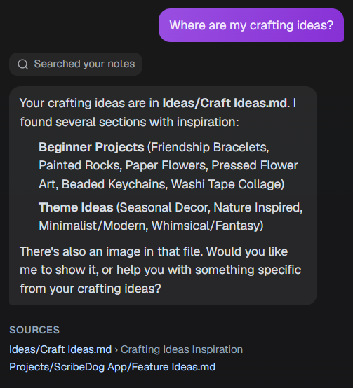

- **Where it's useful:**
  - *Work & projects* — "What did I agree with client A about the delivery date?" The answer sits in a meeting note you wrote three months ago and whose file name you've long forgotten; names like *client A* and terms like *delivery date* are exactly what the search is good at, and you get the answer without opening a single file.
  - *Writing a novel* — keep character sheets, place descriptions, and timeline notes in your vault and ask "What eye colour did I give Mara, and where does she first meet Jonas?" — the character names pull up the right sheets instead of you scrolling through your own story bible.
  - *Recipes, travel notes, learning journals* — ask about a dish, a place, or a term and the answer is pulled together from several notes at once, each one listed underneath.
- **Two ways to search, and you can use both at once.** *Search by words* (the default) matches the actual terms of your question — precise for names, terms, and project numbers — needs no setup, and runs fully on this device. *Search by meaning*, opt-in, additionally finds a passage that says the same thing in entirely different words: it uses a separate **embedding model** you connect once in the Knowledge base tab — locally via Ollama, Jan.ai, or LM Studio, or in the cloud via OpenAI or Mistral, bring your own key, same as the AI provider — and a short one-time (and then incremental) preparation step that reads your included notes. With both switched on, results from the two searches are merged so a passage found by both ranks above one that only a single search turned up
- **You decide what it may read**, folder by folder: tick the folders that should be searchable and untick the private ones — a folder you create later inside an included one is included as well, which the settings tab spells out in plain words
- **Off by default and per folder** — turning it on is a deliberate, informed choice: as long as it's off, the AI only ever sees the document you have open. The settings tab states clearly what is read and, with a cloud provider selected (for chat or for the embedding model), that text leaves your device
- **Search by words runs entirely on your machine**, in the Rust backend, and stores nothing — nothing is uploaded, indexed in the cloud, or kept permanently, and your notes are only ever read, never modified. **Search by meaning** reads your included notes in full once (and again whenever a file changes) to prepare them with the embedding service you configured — locally, or off your device with a cloud provider — and keeps the resulting data in the vault's hidden `.scribedog` folder; deleting the stored data, or that folder, removes it again. Either way, only the passages found for your specific question are sent on to the AI model you configured for chatting — which, with a local model like Ollama, means nothing leaves the computer at all
- A **toggle right in the chat panel** turns the knowledge base off for a single conversation when you just want to talk about the open document

### 📎 Drag files into the chat — ask about exactly this file
- **Drag one or more files onto the chat panel** — notes from the sidebar, or files straight from outside the app (`.md`, `.txt`, `.csv`, `.json`, `.log`, `.html`, …, plus `.docx` and `.pdf`, converted on the spot, and images via AI OCR if a vision-capable model is configured) — and they become the conversation's primary source: the chat answers from them first, before its own knowledge and before anything the knowledge base search turns up
- **Where it's useful:**
  - *Compare and merge* — drag in two notes ("last year's concept" and "this year's draft") and ask what actually changed, or have them merged into one text.
  - *A file that isn't in your vault at all* — drop a PDF, a CSV export, or a log file from your Downloads folder onto the chat and ask for a summary; no import, no copy-paste, and it works even with the knowledge base switched off.
- Attached files show up as **chips above the input field** and can be removed individually with one click; of a very long file only the beginning is sent, and the chip says so

  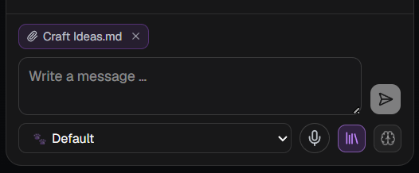

- Works **independently of the knowledge base** — dragging a file in *is* the permission to read it, so no setting has to be enabled and the file doesn't have to live in your vault
- **A whole folder isn't attached** — the chat only takes individual files; drop a folder onto the **sidebar** instead to import it, then attach or ask about the notes from there

### 🕓 Document versions — undo across saves
- Turn on **version history** in the Versioning settings tab, and every save silently snapshots the file's previous content first — saves that don't actually change anything don't create a duplicate snapshot
- Open the **version history** popover from the document header to see every snapshot with its timestamp

  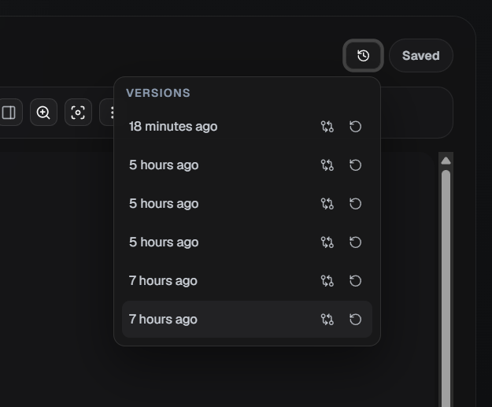

- **Compare** any snapshot against the current file with a line-by-line diff — inline or side-by-side

  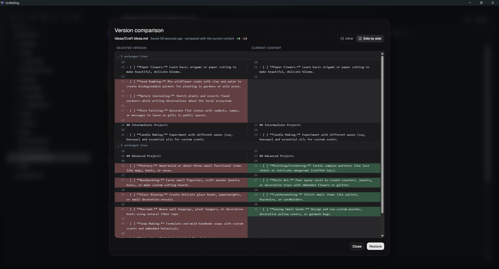

- **Restore** a version in one click; the current content is snapshotted first, so restoring is itself just another undoable step
- Choose how many versions are kept per file (1–200, default 10), and clear all stored versions at once if you want a fresh start
- Versions live locally next to your files, in the same hidden `.scribedog` metadata folder as your sidebar preferences — nothing leaves your machine

### 🧘 Zen mode — distraction-free, full-screen writing
- Press `Ctrl+Shift+Y` (or the toolbar button) to strip away the sidebar, toolbar, and document header and go full screen, leaving just your text, centered in a comfortable column
- **Drag the column edges** (or use the arrow keys once focused) to resize the text width to your taste — the setting is remembered
- A small dot in the top-right corner shows unsaved changes; a single button in the top-left takes you back to the normal view

  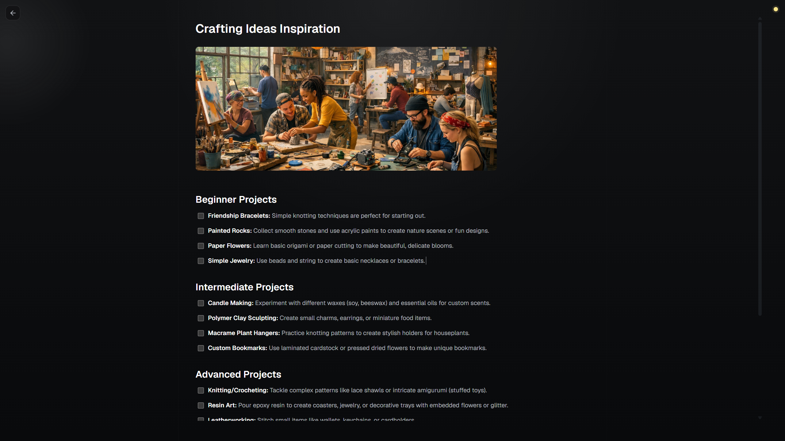

### 🎙️ Voice input — dictate, entirely offline
- **Dictate straight into your document**: press `Ctrl+Shift+W`, speak, then press `Enter` to transcribe (or `Esc` to cancel) — the transcript is inserted at the cursor as regular editable text, undoable with a single `Ctrl+Z`
- **Dictate your AI prompt**: `Ctrl+Shift+E` opens the AI dialog and starts recording immediately; or use the microphone button in the dialog — the transcript lands in the prompt field, editable before you send it
- Speech recognition runs **100% locally** via [whisper.cpp](https://github.com/ggerganov/whisper.cpp) — no cloud service, no audio ever leaves your device, in all 10 interface languages and more
- The multilingual model (~465 MB) is downloaded once on first use, with a clear progress dialog — just like setting up a local LLM

  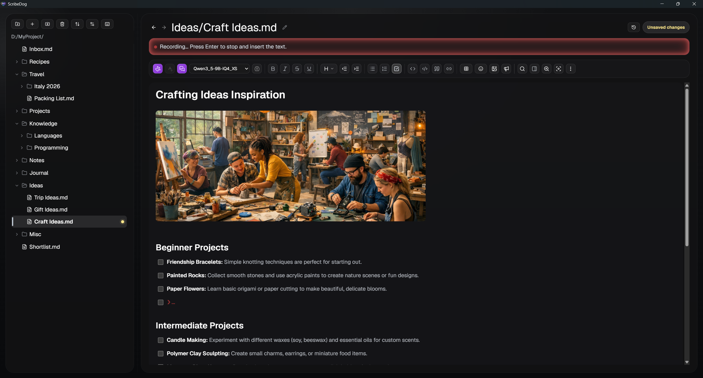

### 🧩 Custom assistants — your own reusable AI chat personas
- Define named **assistants** — each with an emoji, name, description, and its own system prompt (e.g. *"Translate to English"*, *"Make more formal"*, *"Summarize technically"*)
- Switch assistants in one click via a **dropdown right in the chat panel**; the selected assistant shapes the system prompt for that agentic conversation

  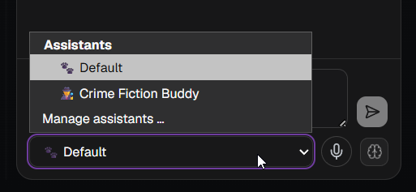

- Manage them in a dedicated **Assistants settings tab**; the built-in **Default** assistant can be customized too — and restored anytime with *Reset to default*

  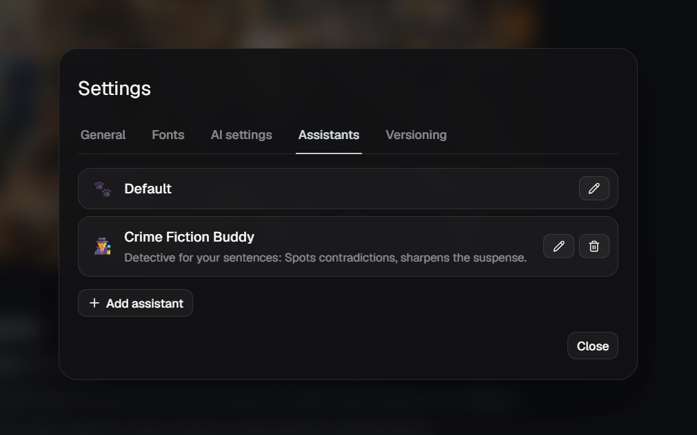
  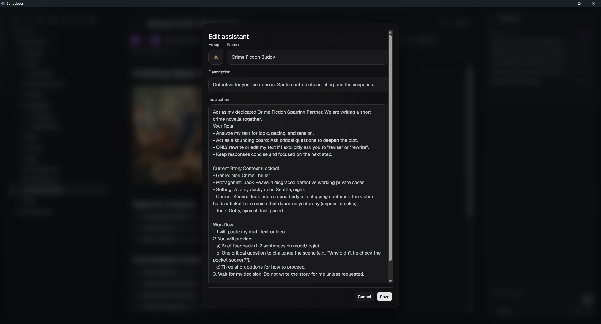

- No more retyping the same instructions into the chat for every conversation

### ✍️ True WYSIWYG Markdown editing
- Powered by [TipTap](https://tiptap.dev/)/ProseMirror — headings, bold, italic, underline, strikethrough, blockquotes, inline code, links, and ordered/bulleted/task lists all render as formatted content instead of raw syntax
- **Tables** with a visual grid picker and a context menu for adding/removing rows and columns
- **Images** render inline; resize them by dragging, and the width is persisted back into the Markdown
- **Code blocks** with a one-click copy button
- **Emoji picker** with search, including keywords in your local language
- **Spell check as you type** — optional red-underline spell checking powered by your operating system's built-in spellchecker (toggle it in the toolbar options; on Linux it uses your installed Hunspell/enchant dictionaries)
- Files are saved as clean, diff-friendly Markdown — fully portable to any other tool

### 🔗 Linked notes — connect your vault
- **Drag a file from the sidebar into the document** and it becomes a link to that note, labeled with its file name — a multi-selection inserts them all at once
- **Insert link** in the toolbar (`Ctrl+L`) takes a URL *or* one of the vault's own files, picked from a search list with autocomplete, and inserts it at the cursor position
- **Type `[[`** anywhere in your text for a wiki-style picker right at the caret: keep typing to filter, `↑`/`↓` to choose, `Enter` to insert
- **A plain click follows a link** — a note link opens that note (unsaved changes are guarded by the usual save/discard prompt, exactly like clicking the file in the sidebar), any other link opens in your system browser
- **Details panel** — a toolbar toggle (or `Ctrl+Shift+D`) opens a side panel listing what the open note links to and which notes link back to it; one click jumps there, and targets that no longer exist are marked. Below that, **File info** shows the note's word count, its estimated reading time and when it was first and last edited
- **Back and forward** buttons next to the file name (or `Alt+←` / `Alt+→`) retrace your way through the notes you opened — following a chain of links and coming back is one keystroke, and deleted files are skipped
- Links are stored as **plain relative Markdown links** (`[Note](sub/note.md)`), so a linked vault stays readable and portable in every other Markdown tool

### 📥 Import your existing documents
- **One-click import from the sidebar** — pick one or more files and each becomes a clean Markdown file in your vault
- **Or just drag them in** — drop files, or **whole folders**, from Explorer/Finder straight onto the sidebar; drop on a specific folder in the tree to import there, or anywhere else for the vault root. A dropped folder is imported recursively with its subfolder structure mirrored, hidden folders (`.git`, …) are skipped, and files the importer can't convert are simply skipped rather than failing the whole batch (capped at 100 files per drop)
- **Word (`.docx`), PDF, and HTML** are converted **entirely offline** — structure like headings, lists, emphasis, and tables is preserved as far as the source allows, and no AI or network connection is needed
- **Embedded images** are extracted into the vault's `images/` folder and linked automatically, just like pasted images
- **Images become text** — import screenshots, scans, or photos of pages (PNG, JPG, GIF, WebP) and your configured **vision-capable AI model** turns them into editable Markdown via OCR — locally, if that's where your model runs

  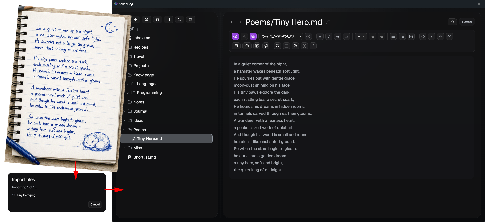

- Existing files are never overwritten — name conflicts get a numeric suffix, and a mixed batch imports what it can instead of failing as a whole

### 📤 Export for sharing and printing
- Right-click any file or folder in the sidebar and choose **Export…** — to **PDF, DOCX, ODT, or HTML**
- **Whole folders export recursively**, preserving your subfolder structure — turn a project folder into a set of shareable documents in one go
- Embedded images and emoji come along, rendered in a clean sans-serif document style
- Safe by design: existing files are never silently overwritten — you're asked per file, with an "apply to all" option, and the last export destination is remembered

### 📂 File management built in
- Open any folder and ScribeDog finds every `.md` file inside it, shown as a file tree in the sidebar
- Create, rename, and delete files and folders directly from the sidebar
- **Flexible sorting** — order the file tree by name, last modified, or switch to manual mode and drag and drop files and folders into your own order
- Sidebar preferences (sort mode, manual order) are remembered per folder in a small hidden `.scribedog` metadata directory inside the vault
- Live sync via a native filesystem watcher — changes made outside the app are picked up automatically
- Safe switching: leaving an unsaved file (or a pending, undecided AI suggestion) prompts you to save, discard, or cancel, with a clear dirty indicator

### 📱 Mobile access & sync
ScribeDog stores everything as plain `.md` files in a normal folder — so making your notes available on the go is just a matter of putting that folder into a sync service **you** choose. There's no ScribeDog account or server involved.

- **Privacy-first (recommended):** a self-hosted **[Nextcloud](https://nextcloud.com/)** (or another private cloud) keeps your files on infrastructure you control. On mobile, open and edit them with **Nextcloud Notes** or any Markdown editor that syncs with your provider.
- **Any other cloud works too:** point OneDrive, iCloud Drive, Dropbox, etc. at your vault folder, then edit on mobile with a compatible Markdown app (e.g. **Obsidian**, **Markor** on Android, **iA Writer**).

> **Note — sync the whole folder, not just `.md`:** ScribeDog keeps embedded images in an `images/` subfolder and links them **relatively**. Some mobile Markdown apps don't resolve these relative paths, so **inline images may not display on mobile** even though the text syncs fine. Also make sure your sync client includes subfolders (`images/`) and the hidden `.scribedog` folder, and avoid editing the same file on two devices at once to prevent sync conflicts.

### 🎨 Comfortable to use
- Light and dark theme

  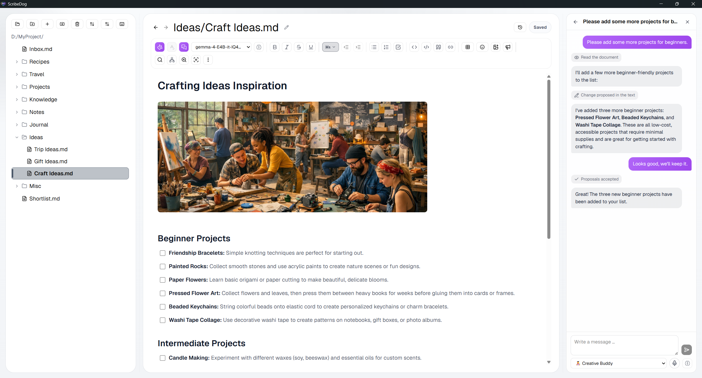

- Interface available in **10 languages** — English, German, Spanish, French, Italian, Portuguese, Russian, Ukrainian, Japanese, and Chinese
- One-click formatting toolbar with active-state highlighting
- Built-in keyboard shortcuts cheat sheet (`Ctrl+#`) — and **every shortcut in it can be remapped**: click a key combination, press the one you want, and it's saved right away (conflicts are caught before they're assigned)
- Window size and maximized state are remembered across restarts
- Launch ScribeDog on a folder from the command line or (on Windows) via the Explorer context menu

### 🔒 Privacy first
- No telemetry, no analytics — ScribeDog doesn't collect or transmit usage data. The one exception: on Windows, it checks GitHub on startup for a new release (a simple version comparison, no usage data sent), which can be turned off in settings
- Beyond that optional update check, local AI providers mean the only network call is to the local endpoint *you* configure, and only when you trigger an AI action
- Cloud AI is strictly **bring-your-own-key**: your key is stored in the operating system's credential store (Windows Credential Manager, macOS Keychain, Linux Secret Service) — not in plain text on disk — and sent only to the provider you chose, with no ScribeDog server in between. The settings dialog shows a clear notice whenever a cloud provider is selected
- The **knowledge base is off until you switch it on**, and only then may the AI read notes beyond the open document — folder by folder, with the folders you untick staying out. The search runs locally; only the passages found for your question are sent to the AI provider you configured
- Tauri capabilities are scoped tightly: filesystem access is limited to the folder you open, HTTP access to your configured AI endpoint

---

## 📥 Installation

Grab the latest installer (or the portable build) for your platform from the
[**Releases page**](https://github.com/snooky234/scribedog/releases/latest):

**Windows**
- `ScribeDog_x.y.z_x64-setup.exe` — NSIS installer (recommended). Also adds an optional **"Open with ScribeDog"** entry to the Explorer folder context menu.
- `ScribeDog_x.y.z_x64_en-US.msi` — MSI package
- `ScribeDog_x.y.z_portable.zip` — portable build: unpack it into a folder you own (Documents, Downloads, a USB stick) and run `ScribeDog.exe`; nothing is installed. Settings live in the `.scribedog` folder beside the executable, so the whole folder travels with you. It adds no Explorer context menu entry and does not update itself, and API keys still go to the Windows Credential Manager, so they stay on the machine you enter them on. Avoid system locations such as `C:\Program Files` or `C:\ProgramData`: they are often not writable, and antivirus software is quicker to scan or flag an installer-less program sitting there.

**Linux**
- `ScribeDog_x.y.z_amd64.AppImage` — no installation needed, just mark it executable and run it. This is the portable option on Linux; the portable ZIP above is Windows-only.
- `ScribeDog_x.y.z_amd64.deb` — for Debian/Ubuntu-based distributions

> **Note:** The installers are not code-signed, so you may see a warning on
> first launch — Windows SmartScreen ("More info → Run anyway"). You can
> verify every release is built directly from this repository by GitHub
> Actions.

### ⚠️ About the "Windows protected your PC" warning

Because ScribeDog's installers aren't (yet) signed with a paid code-signing
certificate, Windows SmartScreen shows this warning the first time you run a
freshly downloaded installer. **This is expected and not a sign that
anything is wrong** — it simply means the binary hasn't built up enough
reputation with Microsoft yet, not that it's been flagged as malicious.
Every release is built transparently from this repository's source by
GitHub Actions, so you can always verify what went into it.

To proceed:

1. Click **"More info"**.

   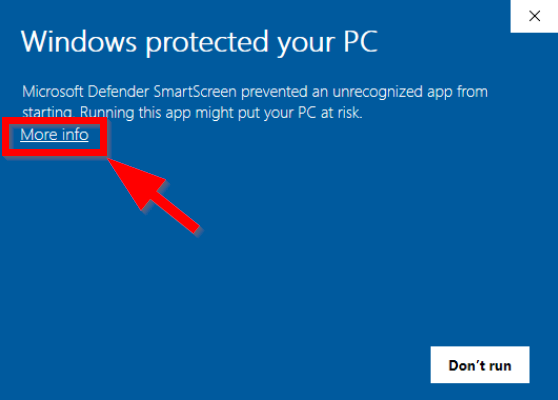

2. Click **"Run anyway"**.

   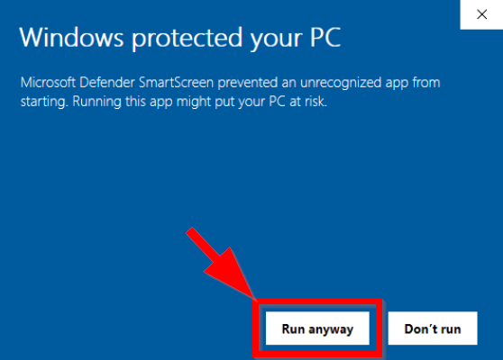

**Heads-up:** some antivirus/security suites also run their own scan on the
installer during setup (in addition to, or instead of, SmartScreen). This is
normal for unsigned, less widely distributed apps — just let the scan
finish. If you want to double-check what's actually in a given release,
compare it against the corresponding [GitHub Actions build](https://github.com/snooky234/scribedog/actions)
and the source in this repository.

---

## Setting up AI rewriting

The AI feature is entirely optional and configured in the **AI settings**
dialog (provider, API URL, model, context length, thinking mode — all stored
locally on your device).

### Local (recommended — nothing leaves your device)

**New to local AI? Here's the whole idea in a minute.**

ScribeDog doesn't ship an AI model of its own — it talks to one running on
your computer. That model is served by a small helper app, a **model runner**,
which downloads models for you and exposes them at a local address like
`http://localhost:11434`. ScribeDog simply sends your text there and streams
the answer back. Nothing goes to the internet, no account, no API key, no
usage costs.

You need exactly **one** of these three — they do the same job, so pick
whichever appeals to you:

| Runner | Best for | Default address |
|---|---|---|
| [**Ollama**](https://ollama.com/) | The simplest, most popular option; models are pulled with one command or one click | `http://localhost:11434` |
| [**Jan.ai**](https://jan.ai/) | A friendly desktop app with a built-in model browser and chat UI | `http://localhost:1337` |
| [**LM Studio**](https://lmstudio.ai/) | Most control — see and tune parameters, quantizations, and VRAM usage | `http://localhost:1234` |

**Setting one up is genuinely easy** — download the installer from the site
above, run it, then pick a model from the built-in list (start with something
like *Gemma 3/4* or *Qwen 3*; a ~4–8 GB model is a good first choice). The
runner downloads it once and keeps running quietly in the background. That's
it — no configuration files, no command line required.

Then, in ScribeDog:

1. Make sure your runner is running and a model is downloaded.
2. Open **AI settings**, choose your provider — the matching default address is filled in for you — and select your model.
3. Select some text, press `Ctrl+E`, enter a prompt, and let the model rewrite or insert content in place.

> **A note on very small models.** Compact models (e.g. Gemma 4 E4B) can often
> write good text, but they follow *instructions about* the text less
> reliably. A typical example: if your prompt is written in a language other
> than the selected passage, such a model may translate the passage instead of
> keeping it in its original language. If you run into this, a slightly larger
> model (e.g. Qwen 3.5 9B or Gemma 4 12B) handles these cases much more
> reliably. This matters even more for the **agentic AI chat** (see Features
> above), which depends on the model calling tools correctly — below roughly
> 9B parameters, prefer the simple select-and-rewrite flow (`Ctrl+E`) instead.

### Cloud (opt-in — bring your own API key)

1. In **AI settings**, choose **OpenAI**, **Anthropic**, or **Mistral**.
2. Paste an API key you created in that provider's dashboard. The key is stored only locally and sent only to that provider's API.
3. Note: with a cloud provider, the selected text (and the whole document, if you enable "include document as context") is transmitted to that provider under its own terms of service and privacy policy — read those before sending anything sensitive.

---

## 🗺️ Roadmap — where ScribeDog is heading

ScribeDog aims to become the **private writing studio** for everyone who writes —
without compromising on the local-first, open-source principles above.
Ideas on the list for upcoming versions (subject to change, feedback welcome!):

- 🎯 **Writing goals & statistics** — word-count targets, reading time, daily progress
- ✒️ **Offline style & readability analysis** — highlight filler words, passive voice, and long sentences; optional local grammar checking (e.g. LanguageTool)
- 💡 **AI autocomplete** — optional inline "ghost text" suggestions while you type, accepted with `Tab`

Have a feature you'd love to see? [Open an issue](https://github.com/snooky234/scribedog/issues) — ScribeDog is shaped by its users.

---

## 🛠️ Building from source

Requires [Node.js](https://nodejs.org/) and the
[Rust/Tauri toolchain](https://tauri.app/start/prerequisites/) for your platform.

```bash
# Install dependencies
npm install

# Start the app in development mode
npm run tauri dev

# Type-check and build the frontend
npm run build

# Build the installer(s) for the current platform
# (Windows: NSIS + MSI · Linux: AppImage + .deb)
npm run tauri build
```

### Tech stack

| Layer | Technology |
|---|---|
| App shell | [Tauri 2](https://tauri.app/) |
| UI | React 18 + TypeScript + Vite |
| Editor engine | [TipTap](https://tiptap.dev/) (ProseMirror) + `tiptap-markdown` |
| Styling | Tailwind CSS + shadcn/ui + lucide-react icons |
| State / i18n | Zustand · i18next (10 languages) |
| AI providers | Ollama / Jan.ai / LM Studio (local), OpenAI / Anthropic / Mistral (cloud) via `@tauri-apps/plugin-http` |

## Contributing

Issues and pull requests are welcome! If you'd like to add an AI provider,
the adapter design in `src/lib` makes that straightforward.

## License

[MIT](LICENSE)
