

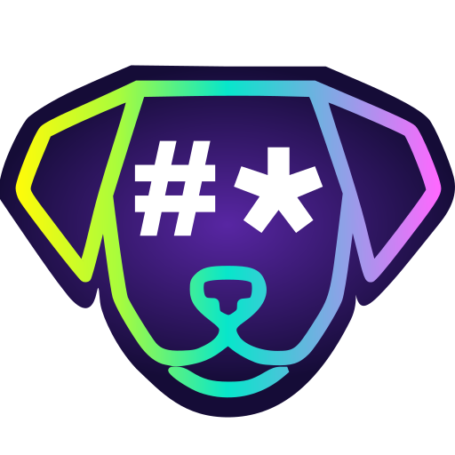

# ScribeDog

**Your private notes and writing studio, in plain Markdown.**\
**Local AI, no account, no lock-in. On your desktop or your own server.**

💻 [Download](https://github.com/snooky234/scribedog/releases/latest) · 📖 [Documentation](docs/README.md) · 🖥️ [Server Edition](server/docs/README.md) · 🐳 [Docker Hub](https://hub.docker.com/r/snooky234/scribedog-server) · 📦 [GHCR](https://github.com/snooky234/scribedog/pkgs/container/scribedog-server)

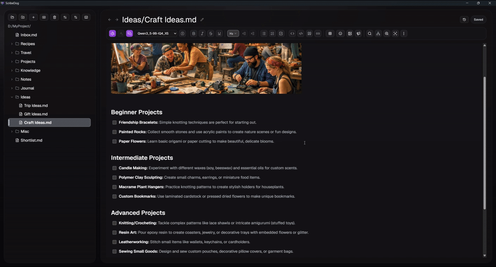

ScribeDog is an editor where you write and format like in a document, with no
raw `#` or `*` in sight. Your notes are plain Markdown files in a folder you
choose, so they stay yours and open in any other tool. Optional AI helps you
rewrite, extend and translate text, answer questions from your own notes, and
even edit across them. It runs fully on your machine, or with a cloud provider
you trust.

## Why ScribeDog?

- 🧠 **A knowledge base of your own notes.** Link notes, see backlinks, and let the AI answer from them with the sources it used.
- 🔒 **Private by default.** No account, no telemetry, nothing leaves your device unless you set it up.
- ✍️ **Easy to write.** True WYSIWYG: headings, tables, images and lists look like a document.
- 🤖 **Supported by local AI.** Ollama, Jan.ai and LM Studio work out of the box. Cloud providers are strictly opt-in.
- 🧘 **Distraction free.** A full-screen Zen mode with just your text.
- 🎨 **Yours to style.** Six built-in themes and a theme builder for your own.
- 📄 **Plain Markdown, no lock-in.** No database, no proprietary format. Open the same folder in any other editor.
- 🖥️ **Desktop or self-hosted.** Use the desktop app, or run the same editor on your own server and reach it from any browser.
- 🔓 **Open source.** MIT licensed, every release built from this repository by GitHub Actions.

**Who is ScribeDog for?**

- 📝 **Note-takers & journalers**: a private knowledge folder or diary that no cloud service sees
- 🏠 **Self-hosters & homelabbers**: your notes on your own Docker host, NAS or Pi, reachable from every device
- ✍️ **Authors & bloggers**: draft, rewrite and expand text with an AI that does not train on your manuscript
- ✉️ **Everyday writers**: letters, applications, meeting notes, with the AI polishing tone locally
- 🧑‍💻 **Developers & documenters**: clean, diff-friendly Markdown that works with Git and every other tool

---

## ✍️ Write and organize

### True WYSIWYG editing

Headings, tables, images, code blocks and task lists render as formatted
content. The file on disk stays clean Markdown. Highlight passages, move lines
with the keyboard, paste Markdown and see it rendered at once, and copy as
formatted text, Markdown or plain text.

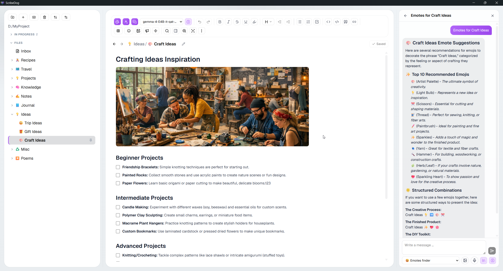

[Read more →](docs/writing.md)

### Sketch right in your note

Draw with the mouse, a finger or a pen, pick a line width and colour, and
insert the sketch at the cursor. It is saved as an SVG image in your vault, and
a double-click opens it again for editing.

[Read more →](docs/writing.md#drawings)

### Your vault: files, folders and linked notes

Open any folder and every `.md` file appears in a tree. Link notes by dragging
them in, by typing `[[`, or through the link dialog. A details panel shows the
outline, links and backlinks. Folders can have a note of their own, like a node
in Trilium or Notion. Pin the notes you are working on, and unsaved edits
survive a restart.

[Read more →](docs/notes-and-vault.md)

### Version history

Every save can snapshot the previous version. Browse them, compare line by line
inline or side by side, and restore with one click.

[Read more →](docs/notes-and-vault.md#version-history)

### Zen mode

One key strips away everything but your text, centered in a column you can
resize. Zoom it separately from the normal view.

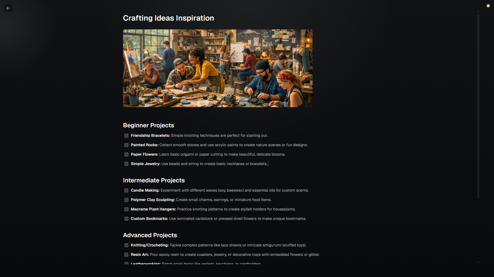

[Read more →](docs/writing.md#zen-mode)

### Voice input, 100% offline

Dictate into a note or into an AI prompt. Speech recognition runs locally with
whisper.cpp, so no audio ever leaves your device.

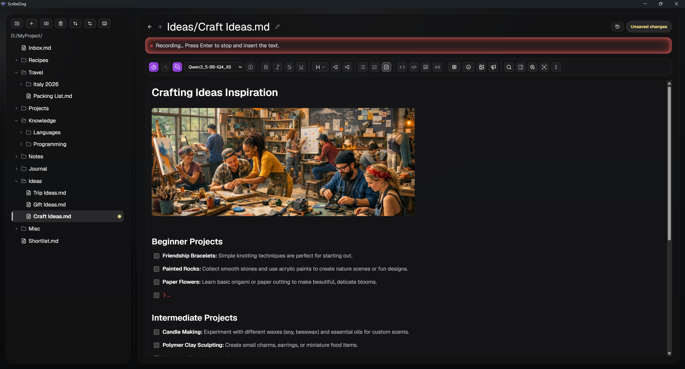

[Read more →](docs/voice.md)

### Themes you can make your own

Light, dark, Sepia, Fjord, Fireside and a true-black Midnight, plus a theme
builder where you pick a few colours and the rest follows, down to how the
note you are working on is marked in the sidebar. Export and share your
themes as JSON. The interface speaks 10 languages, and every keyboard
shortcut can be remapped.

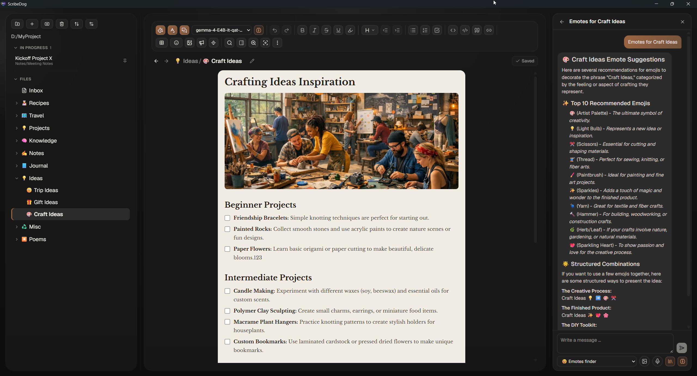

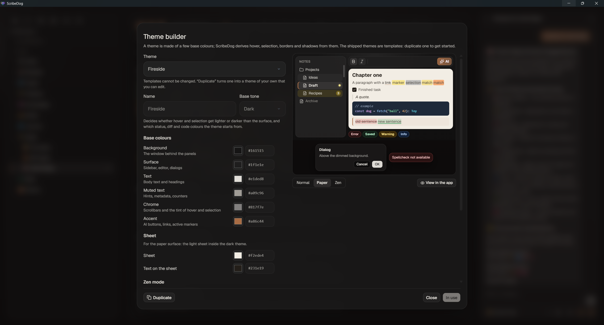

[Read more →](docs/customizing.md)

---

## 🤖 AI, local by default

**Local AI is genuinely usable today.** Modern open models like Gemma 3/4 or
Qwen 3 run well on a mid-range gaming GPU with 6 GB of VRAM, and smaller
variants run on laptops without a dedicated GPU. That is plenty to rewrite
paragraphs, fix tone and grammar, draft a letter or summarize notes.

### Rewrite, insert and review

Select text, press `Ctrl+E`, and watch the model rewrite or insert it live. The
original stays highlighted in red while the answer streams in below it. You
accept, discard or keep refining, and one `Ctrl+Z` undoes an accepted edit.
There is an AI spelling and grammar check too.

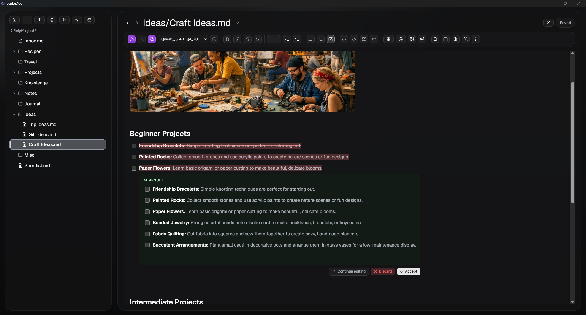

[Read more →](docs/ai-writing.md)

### Agentic chat across your whole vault

A side-panel chat that reads your note and proposes edits itself. It can work
on files you have not opened: those changes are staged and shown as the same
red and green review when you open the file. A whole batch can be undone in one
click, and for bigger goals the agent keeps a visible step-by-step plan.
Nothing is written before you accept it.

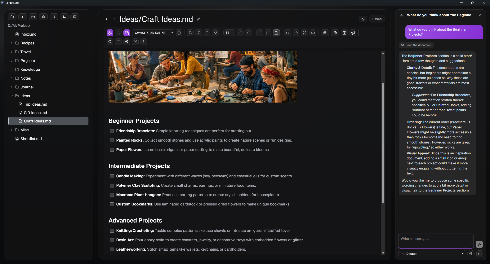

> **Model size:** the chat needs a capable model, roughly 9B parameters and up
> or a cloud model. Smaller models should stick to select and rewrite.

[Read more →](docs/ai-chat.md)

### Your own assistants

Save named system prompts such as "Translate to English" or "Make more
formal", and switch between them from a dropdown in the chat.

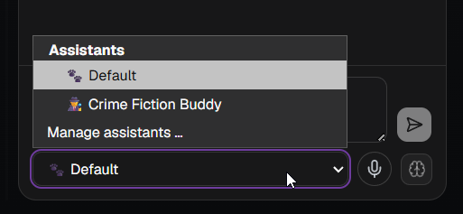

 

[Read more →](docs/ai-chat.md#custom-assistants)

### Knowledge base: answers from your own notes

Switch it on and the chat is no longer limited to the open file. It searches
your notes by word or, opt-in, by meaning, and answers with the list of notes it
used. You choose the folders it may read, and it is off by default.

[Read more →](docs/knowledge-base.md)

### Files as context

Drag notes from the sidebar, or files from outside the app (text, Word, PDF,
even images through OCR), onto the chat and ask about exactly those.

[Read more →](docs/knowledge-base.md#attach-files-to-the-chat)

---

## 📥 Import, export and sync

### Import your existing documents

Bring in Word, PDF and HTML offline, as clean Markdown, by picking files or
dropping whole folders onto the sidebar. Screenshots and scans become text
through OCR with your vision-capable model.

[Read more →](docs/import-export.md#import)

### Export for sharing and printing

Export notes or whole folders to PDF, DOCX, ODT or HTML. Choose A4, US Letter,
A5 or US Legal, add manual page breaks, and show the page ends right in the
editor so the PDF and the print match.

[Read more →](docs/import-export.md#export)

### Mobile access and sync

Everything is a plain `.md` file, so any sync service works. A self-hosted
Nextcloud is the privacy-first choice. Or skip syncing and use the Server
Edition below.

[Read more →](docs/sync-and-mobile.md)

---

## 🖥️ Self-hosted: the Server Edition

Run the same ScribeDog on your own server (Docker, a Raspberry Pi, a NAS, a
small VM) and use it from any browser, phone or tablet, with the same editor,
file management, version history and AI features. The layout follows the
screen it is on, down to the gestures a phone is used with. The desktop app can
open that server vault too, with its AI and dictation running on your computer.
One password, your folder, no account.

### Shared vaults for a household or a team

Everyone on the box gets their own vault and their own password, and can share
a vault with the people they pick. When two of them save the same note, the
edits are merged instead of one overwriting the other, and the file tree marks
what someone else has open right now.

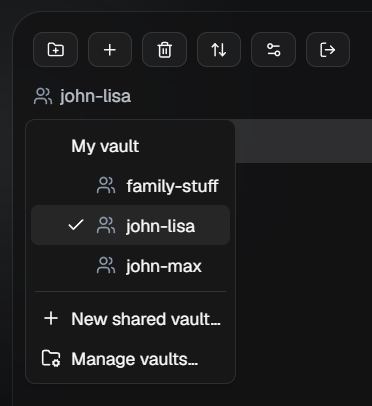

[Read more →](server/docs/multiuser.md#shared-vaults)

### On phones and tablets

On a phone the formatting toolbar sits above the keyboard, and the file list
swipes in from the left. A tablet in landscape keeps that list next to the
note. Add the site to the home screen and it opens like an app.

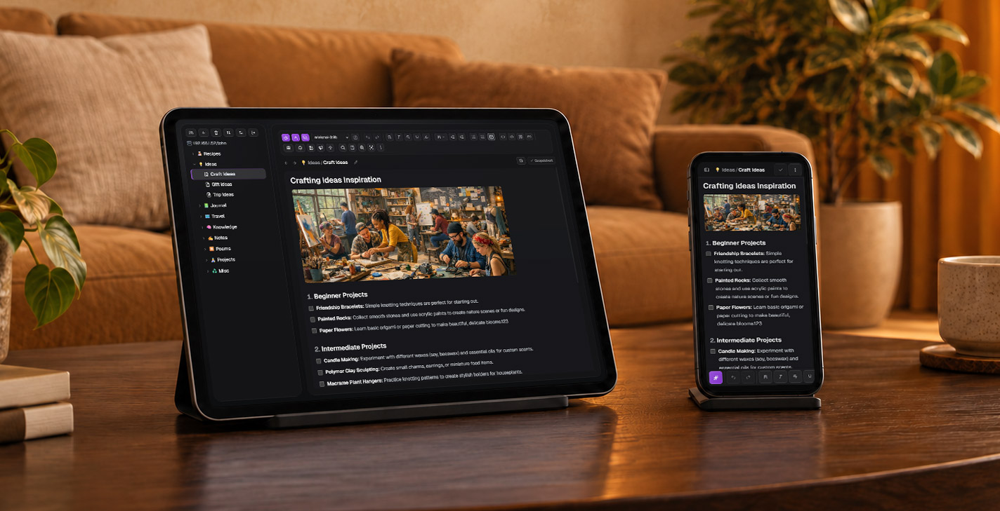

[Read more →](server/docs/phones-and-tablets.md)

[Server Edition guide →](server/docs/README.md) · [Getting started](server/docs/getting-started.md) · [The desktop app as a client](server/docs/desktop-app.md) · [Security](server/docs/security.md) · [FAQ](server/docs/faq.md)

---

## 🔒 Privacy first

- No telemetry, no analytics. The one automatic network call is an optional update check on Windows, which you can turn off.
- Local AI means the only network call goes to the endpoint *you* configure, and only when you trigger an AI action.
- Cloud AI is bring-your-own-key. The key lives in the credential store of your operating system, and there is no ScribeDog server in between.
- The knowledge base is off until you switch it on, and you pick the folders.
- File access is limited to the folder you open.

[Read more →](docs/privacy.md)

---

## 📥 Installation

Get the latest build from the [Releases page](https://github.com/snooky234/scribedog/releases/latest).

| Platform | Download |
|---|---|
| Windows | `ScribeDog_x.y.z_x64-setup.exe` (recommended), the `.msi`, or `ScribeDog_x.y.z_portable.zip` (nothing installed) |
| Linux | `ScribeDog_x.y.z_amd64.AppImage` (no installation) or the `.deb` |

<b>Windows says "Windows protected your PC"?</b>

The installers are not signed with a paid code-signing certificate yet, so
SmartScreen warns on the first run. This is expected. It only means the file has
not built up reputation with Microsoft yet. Every release is built from this
repository by GitHub Actions.

1. Click **More info**.

   

2. Click **Run anyway**.

   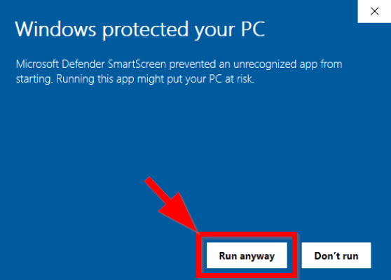

[Full installation guide →](docs/getting-started.md)

## 🧰 Setting up AI

AI is optional. To use a local model, install one model runner
([Ollama](https://ollama.com/), [Jan.ai](https://jan.ai/) or
[LM Studio](https://lmstudio.ai/)), download a model of about 4 to 8 GB, then
choose the provider in **AI settings**. For the cloud, pick OpenAI, Anthropic or
Mistral and paste your own API key.

[Full AI setup guide →](docs/ai-setup.md)

---

## 🗺️ Roadmap

ScribeDog aims to be the private place for your notes and writing, without
compromising the local-first, open-source principles above. Ideas for upcoming
versions, subject to change:

- 🎯 **Writing goals & statistics**: word-count targets, reading time, daily progress
- ✒️ **Offline style & readability analysis**: highlight filler words, passive voice and long sentences, with optional local grammar checking (for example LanguageTool)
- 💡 **AI autocomplete**: optional inline "ghost text" suggestions while you type, accepted with `Tab`

Have a feature you would love to see? [Open an issue](https://github.com/snooky234/scribedog/issues). ScribeDog is shaped by its users.

## 🛠️ Building and contributing

Requires Node.js and the Rust and Tauri toolchain. See [Building from source](docs/building.md)
for the commands and the tech stack. Issues and pull requests are welcome.

## License

[MIT](LICENSE)
